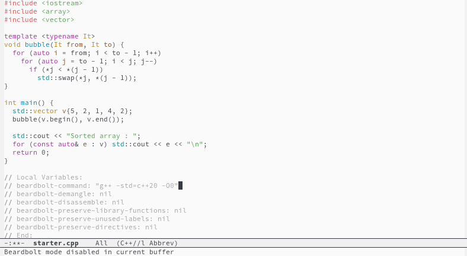

# Beardbolt



An experimental fork-rewrite of
[RMSbolt](https://gitlab.com/jgkamat/rmsbolt), itself a supercharged
implementation of [godbolt, the
compiler-explorer](https://github.com/mattgodbolt/compiler-explorer)
but for Emacs, instead of a clunky browser.

Beardbolt shows assembly output for given source code file, making it
easy to see what the compiler is doing.

It also highlights which source code corresponds to a given assembly,
and vice versa.

### Why RMSbolt over Beardbolt

- Supports more languages/compilers. Beardbolt only C++/C clang/gcc for now.
- Has good documentation and a proper API.
- Supports more Emacs versions.  Beardbolt probably only 28+

### Why Beardbolt over RMSbolt

- Doesn't require file to be saved.
- 2-5x faster on typical files.  See [here for benchmarks](#benchmarks).
- 🌈Has pretty rainbows🌈
- Has the useful "preserve library functions" feature of Godbolt.
- Less buggy AFAICT (TODO: show actual RMSbolt problems)
- Simpler code (less than half the LOC, but also less funcional in some regards if we're honest).

### Installation

```sh
cd /path/to/beardbolt/clone
make
```

```lisp
(add-to-list 'load-path "/path/to/beardbolt/clone")
(require 'beardbolt)
```

```
M-x beardbolt-starter
```

<a name="benchmarks"></a>
### Benchmarks vs RMSbolt

First note that Beardbolt is highly hacky/experimental and may be
providing incorrect results, in which case most/all of the following
benchmarks/comparisons are probably invalid.

Second, a word on what "fast" means: the performance metric to
optimize is responsiveness.  Both Beardbolt and RMSbolt continuously
analyze the program to present a "live" view of its assembly output.
The goal is not only to provide this service as quickly as possible,
but also to intrude as little as possible in the user's editing.

Both extensions work in a two-step fashion.  Beardbolt tries to
optimize step 2.

1. The file is saved and partially compiled by an external program

   This happens asynchronously.  It might takes several seconds and
   spin up your CPU, but it does not generally harm the UX inside
   Emacs.

2. Some Elisp processing takes place on the assembly output

   This happens inside Emacs, and it's generally bad if it takes a
   long time, because Emacs is single-threaded and has no easily
   accessible asynchronous mechanisms for this type of work.

#### Results

To run the benchmarks, have both RMSbolt and Beardbolt clones
side-by-side, then:

```
$ cd /path/to/beardbolt/clone
$ EMACS=~/Source/Emacs/emacs/src/emacs make benchmark
/home/capitaomorte/Source/Emacs/emacs/src/emacs -Q -L . --batch -l beardbolt-benchmark starters/slow-to-process.cpp
RMSbolt timings for slow-to-process.cpp
  samples: (1.329s 1.316s 1.338s 1.345s 1.341s)
  average: 1.334s
Beardbolt timings for slow-to-process.cpp
  samples: (0.324s 0.338s 0.334s 0.334s 0.342s)
  average: 0.334s
/home/capitaomorte/Source/Emacs/emacs/src/emacs -Q -L . --batch -l beardbolt-benchmark starters/vector-emplace-back.cpp
RMSbolt timings for vector-emplace-back.cpp
  samples: (0.234s 0.223s 0.223s 0.240s 0.224s)
  average: 0.229s
Beardbolt timings for vector-emplace-back.cpp
  samples: (0.086s 0.074s 0.073s 0.074s 0.089s)
  average: 0.079s
/home/capitaomorte/Source/Emacs/emacs/src/emacs -Q -L . --batch -l beardbolt-benchmark starters/unordered-multimap-emplace.cpp
RMSbolt timings for unordered-multimap-emplace.cpp
  samples: (0.534s 0.523s 0.524s 0.523s 0.529s)
  average: 0.527s
Beardbolt timings for unordered-multimap-emplace.cpp
  samples: (0.103s 0.123s 0.103s 0.102s 0.118s)
  average: 0.110s
```

This ran `beardbolt-compile` and `rmsbolt-compile` 5 times on small
two [cppreference.com](https://cppreference.com) examples
([1][example1], [2][example2]) as well as a known "slow" file found in
[RMSbolt's bug tracker](https://gitlab.com/jgkamat/rmsbolt/-/issues/9).

To make the benchmark fair(er?) I patched `rmsbolt.el` to generate
slightly less debug with `-g1` instead of `-g`, and thus benefit from
the same speedup that `beardbolt.el` uses.

The results were obtained on my Thinkpad T480 running Emacs 29
(without native compilation).

[example1]: https://en.cppreference.com/w/cpp/container/vector/emplace_back
[example2]: https://en.cppreference.com/w/cpp/container/unordered_multimap/emplace
